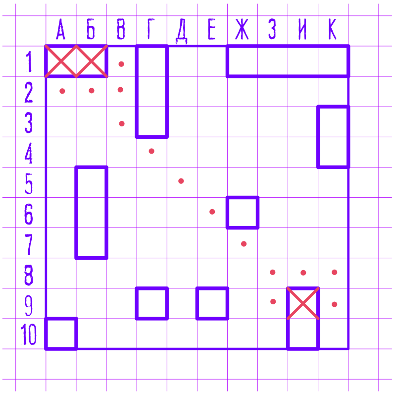

# BattleShip



## A case study: 
*A PART OF MY JAVA COURSE*
### 
*"WEB MULTIPLAYER GAME IN JAVA SPRING"*


## Technologies: 

- Java
- Spring 
- Spring Security
- REST
- Webflow
- Thymeleaf
- Websocket/STOMP
- JS
- JQuery
- Bootstrap


## Resourses:

[My article on Habr](https://habr.com/ru/post/346296)

## Environment (docker-compose):
```
version: '3.7'
services:
  mysql:
    image: mysql:latest
    container_name: some-mysql
    environment:
      MYSQL_ROOT_PASSWORD: bolt
    ports:
      - "3306:3306"
    volumes:
      - mysql-data:/var/lib/mysql

  rabbitmq:
    image: rabbitmq:3-management
    container_name: some-rabbit
    hostname: my-rabbit
    ports:
      - "5672:5672"
      - "15672:15672"
      - "15674:15674"
      - "61613:61613"
    environment:
      RABBITMQ_DEFAULT_USER: user
      RABBITMQ_DEFAULT_PASS: password
    command: ["rabbitmq-plugins", "enable", "rabbitmq_web_stomp", "rabbitmq_stomp"]

volumes:
  mysql-data:
```

